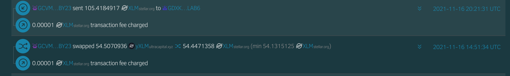
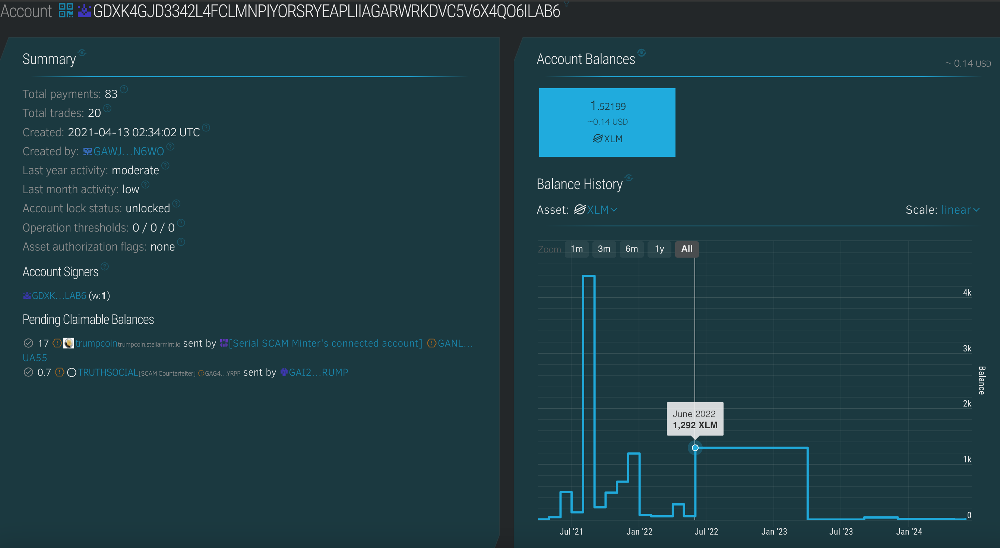
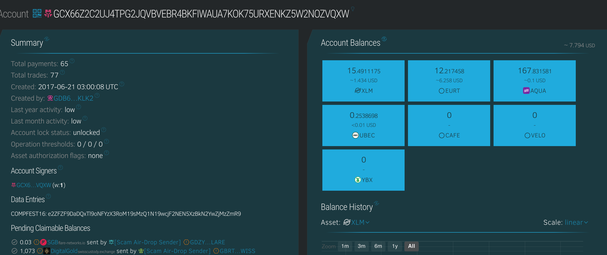

## Write up for the challenge [Crypto] [OSINT] [Blockchain] 


### What are some of the tools required to solve this challenge?

1. stellar_sdk -- Python SDK for Stellar XLM blockchain. Necessary for interacting with the blockchain for this challenge. 
2. stellar-sdk-py -- Another Python SDK for Stellar XLM blockchain. 
3. [Stellar Expert](https://stellar.expert) - Most comprehensive tool for Stellar XLM blockchain. Does have transaction history, memo information, distributed ledger state and more. The most useful thing would be a graph of the balance of the wallet over time. 
4. [Stellar Blockchain Explorer](https://stellarscan.io/) - This is not very good compared to the Stellar Expert, might be more useful if you want to explore the individual transactions. 
5. Other blockchain osint resources on GitHub
    - [Awesome On-Chain Investigations HandBook](https://github.com/OffcierCia/On-Chain-Investigations-Tools-List)
    - [WEB3, CRIPTOCURRENCIES and NFT resources for OSINT investigations](https://github.com/aaarghhh/awesome_osint_blockchain_analysis)
    - [Blockchain Transactions Investigation Tool](https://github.com/s0md3v/Orbit) - I haven't tested this out personally, but it might be worthwhile in exploring this for larger scale (or high level OSINT blockchain challenges)
 

 ### COMPFEST 16 - Open Wallet [Blockchain] 


### Description 
Oh no, I accidentally pushed my secret key on github while developing an arbitrage bot, Now my money is stolen 😭😭😭. Can you help me identify who stole my money? Here is the file i pushed https://github.com/Firdausfarul/Neptunus/blob/master/interleave_testnet_backend/Arbitrageur_XLM_USDC.py . the flag is in blockchain, in one of the thief account.

Author: fahrul


The script reveals the private key of the wallet, along with some other transaction functions. 

``` python

import json
import random
import time
import base64

import stellar_sdk
from stellar_sdk import Keypair,Server, TransactionBuilder, Network, Signer, Asset, xdr
import requests


secret_key='SDW5NLCZJEXYK3RNXVZLAPZDMKQNYRVPKZUOFUYBNH4SYNSCJWECSISD'
acc=Keypair.from_secret(secret_key)

server = Server("https://horizon.stellar.org")
base_fee = server.fetch_base_fee()*100

for i in range(100):
    response1 = requests.get('https://horizon.stellar.org/paths/strict-send?destination_assets=yXLM%3AGARDNV3Q7YGT4AKSDF25LT32YSCCW4EV22Y2TV3I2PU2MMXJTEDL5T55&source_asset_type=native&source_amount=1')
    resp1  =response1.json()
    path = resp1['_embedded']['records'][0]['path']
    path_fr1=[]
    for i in range(len(path)):
        path_fr1.append((Asset(path[i]['asset_code'], path[i]['asset_issuer'] )))
    response2 = requests.get('https://horizon.stellar.org/paths/strict-send?destination_assets=yXLM%3AGARDNV3Q7YGT4AKSDF25LT32YSCCW4EV22Y2TV3I2PU2MMXJTEDL5T55&source_asset_type=native&source_amount=1')
    resp2  =response2.json()
    path = resp2['_embedded']['records'][0]['path']
    path_fr2=[]
    for i in range(len(path)):
        path_fr2.append((Asset(path[i]['asset_code'], path[i]['asset_issuer'] )))

    stellar_account1 = server.load_account(acc.public_key)

    Transaction2 = (
        TransactionBuilder(
            source_account=stellar_account1,
            network_passphrase=Network.PUBLIC_NETWORK_PASSPHRASE,
            base_fee=base_fee,
        )
            .append_path_payment_strict_send_op(
            destination=acc.public_key,
            send_code='yXLM',
            send_issuer='GARDNV3Q7YGT4AKSDF25LT32YSCCW4EV22Y2TV3I2PU2MMXJTEDL5T55',
            send_amount='1',
            dest_code='XLM',
            dest_issuer=None,
            dest_min='1',
            path=path_fr2
        )
            .build()
    )

    stellar_account1.sequence += 1
    Transaction1 = (
        TransactionBuilder(
            source_account=stellar_account1,
            network_passphrase=Network.PUBLIC_NETWORK_PASSPHRASE,
            base_fee=base_fee,
        )
            .append_path_payment_strict_send_op(
            destination=acc.public_key,
            send_code='XLM',
            send_issuer=None,
            send_amount='1',
            dest_code='yXLM',
            dest_issuer='GARDNV3Q7YGT4AKSDF25LT32YSCCW4EV22Y2TV3I2PU2MMXJTEDL5T55',
            dest_min='1',
            path=path_fr1
        )
            .build()
    )


    # Signing+Submitting Transaction1
    Transaction1.sign(acc.secret)
    Transaction2.sign(acc.secret)
    response1 = server.submit_transaction(Transaction2)
    response2 = server.submit_transaction(Transaction1)
    print(response1)
    print(response2)


```


### Write up 


The first step would be to attain the public wallet address from this challenge. This can be attain once you have a private key. 


This is just simply. 

``` python

secret_key='SDW5NLCZJEXYK3RNXVZLAPZDMKQNYRVPKZUOFUYBNH4SYNSCJWECSISD'
acc=Keypair.from_secret(secret_key)
print(acc.public_key)

```


Which prints out the public wallet address `GCVMRAQGQZ5VNX7KUT2O6N2SKQR3ENT2Q2JTRL2YBPSQAPXIRZR2BY23` 

Naturally, once we move over to the Stellar Expert, we can see that the wallet has made a few transactions. As the challenge wanted us to focus on the nefarious outward tranactions, we do notice some that have taken place in the fall of 2021. 


From this wallet, we see that the majority of transaction are minute airdrop (less than 0.01 XLM) from exchange wallets. Notably, most of these source addresses have been marked as "Scam" by the Stellar community. This suggests that the owner has pretty bad OPSEC and tend the take the bait from crypto charlatans.


These two are the most important transactions that we need to focus on. One is a bulk transaction of 105 XLM to the wallet `GDXK4GJD3342L4FCLMNPIYORSRYEAPLIIAGARWRKDVC5V6X4QO6ILAB6`. While the other one is swap transaction between 




Usually, in a crypto sweep-and-run operations, the scammers would tend to moves the funds to a different wallet or into fiat currency as soon as possible. This is usually done through a series of transactions to obfuscate the trail.

From this, we see the wallet moved the build of its funds in late 2021 and Early 2022. The bulk of the stolen funds from our original address would have been moved through this batch. 





From this we observe a pattern, as that the majority of the larger sum (> 100 XLM) movements were transferred to the wallet `GCRAOWEMGUW7N65XLCPRM6W4O4C35T2MJDJFDJEAHMCHAOJXIWZCGVNH`. This wallet belongs to bitgo.com, which is not an exchange but rather a third party crypto custodian service. A bulk of their customers are either institutional investors or high flow exchanges. We are not delving into further of this custodian service. But for further challenges, this might be an interesting point to explore. 


XLM transactions does allow for memes of a  string encoded using either ASCII or UTF-8, up to 28-bytes long. This is traditionally used by exchanges to encode the transaction ID or customer account numbers. 

the account ID of `103413` is found within the memo for all of the large transactions. 

By filtering all of the transactions with memo containing `103413`, we display out the transactions under the suspicious customer account number.


Finally, we realize that the transaction from 
`GCX66Z2C2UJ4TPG2JQVBVEBR4BKFIWAUA7KOK75URXENKZ5W2NOZVQXW` is probably suspicious for this CTF challenges. It's the only transaction from 2024 under the `103413` customer ID. Although IRL blockchain forensics would not have been this straightforward...

Finally we've reached the destination and the flag is in the data entries of the wallet. 




    COMPFEST16: e2ZFZF9DaDQxTl9oNFYzX3RoM19sMzQ1N19wcjF2NEN5XzBkN2YwZjMzZmR9

However, this is not the flag. This is a base64 encoded string. 


#### Flag 
`COMPFEST16{fEd_Ch41N_h4V3_th3_l3457_pr1v4Cy_0d7f0f33fd}`


